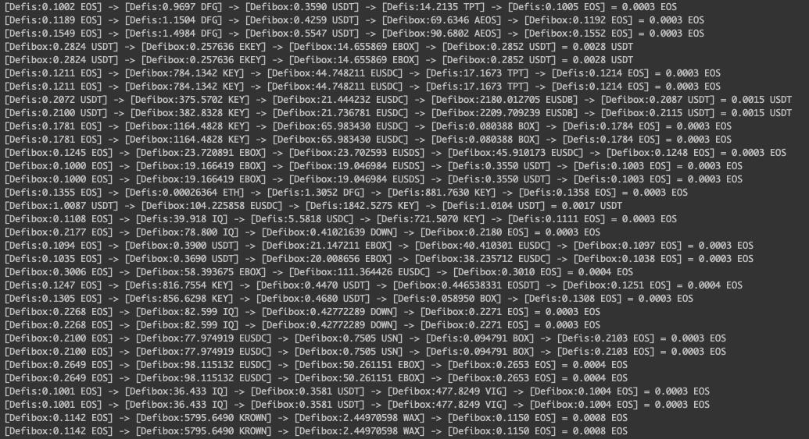

EOS-ARB: EOS链去中心化交易所（DEX）无损套利工具
===

概述
---
EOS-ARB 可以实现在多个DEX之间进行无损套利，套利模式不限于双路径，也可以在多路径之间进行。

举个例子，EOS-ARB 可以在 Defis 和 DefiBox 之间，同时查找3路径套利的可能性。 

再举个例子，以下是 EOS-ARB 能完成的（套利于任意1到N个交易所之间）：  
USDT --> BTC --> USDT # 双路径，至少需要2个交易所  
USDT --> EOS --> ETH --> USDT # 3个及以上路径，可以在1到N个交易所之间套利  
USDT --> EOS --> ETH --> EOS --> USDT   
......  


特性：
---
- 内置多个交易所：Defis Network, DefiBox, Dolphin，并可随意拓展
- 黑名单合约过滤，过滤掉一些容易异常的代币，比如转账燃烧
- 多节点并发查询，尽量避免信息过时
- 无损套利：每次套利，只要最后输出小于（输入+利润），就自动回滚所有交易

效果截图：
---


缺点：
---
- 收益太低, 套利效果远不如直接写合约进行套利
- 不知道为什么，白天看的时候是盈利状态，充了资源后隔天一看，好像又亏损了一点

安装&运行
--
```bash
go get
make bin/arb
./bin/arb test
```

交个朋友：
--


